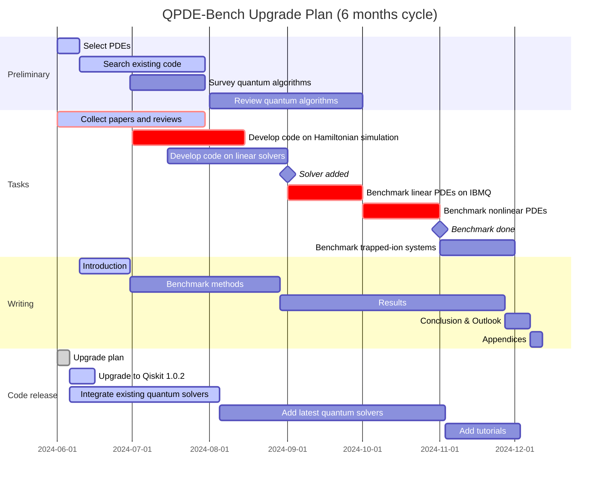

# Upgrade plans

```mermaid
gantt
    dateFormat  YYYY-MM-DD
    title       QPDE-Bench Upgrade Plan (6 months cycle)
    %% excludes    weekends
    %% (`excludes` accepts specific dates in YYYY-MM-DD format, days of the week ("sunday") or "weekends", but not the word "weekdays".)

    section Preliminary
    Select PDEs               :active,    pre1, 2024-06-01,2024-06-10
    Search existing code      :active,    pre2, 2024-06-10,2024-07-30
    Survey quantum algorithms :           pre3, 2024-06-30,2024-07-30
    Review quantum algorithms :           pre4, 2024-08-01,2024-10-01

    section Tasks
    Collect papers and reviews          			:crit, active, task1, 2024-06-01,2024-07-30
    Develop code on Hamiltonian simulation    :crit, 				 task2, 2024-07-01,2024-08-15
    Develop code on linear solvers						:      				 task3, 2024-07-15,2024-09-01
    Solver added                 							:milestone,    m1, 2024-09-01, 0d
    Benchmark linear PDEs  on IBMQ            :crit, 				 task4, 2024-09-01,2024-10-01
    Benchmark nonlinear PDEs                  :crit, 				 task5, 2024-10-01,2024-11-01
    Benchmark done                						:milestone,    m2, 2024-11-01, 0d
    Benchmark trapped-ion systems             :     				 task6, 2024-11-01,2024-12-01
    
    section Writing
    Introduction												:active, doc1, after pre1, 20d
    Benchmark methods                   :        doc2, after doc1, 60d
    Results                             :        doc3, after doc2, 90d
    Conclusion & Outlook                :        doc4, after doc3, 10d
    Appendices                          :        doc5, after doc4, 5d

    section Code release
    Upgrade plan                        :done,   code1, 2024-06-01,2024-06-06
    Upgrade to Qiskit 1.0.2             :active, code2, after code1, 10d
    Integrate existing quantum solvers  :active, code3, after code1, 60d
    Add latest quantum solvers  				:        code4, after code3, 90d
    Add tutorials                       :        code5, after code4, 30d
```